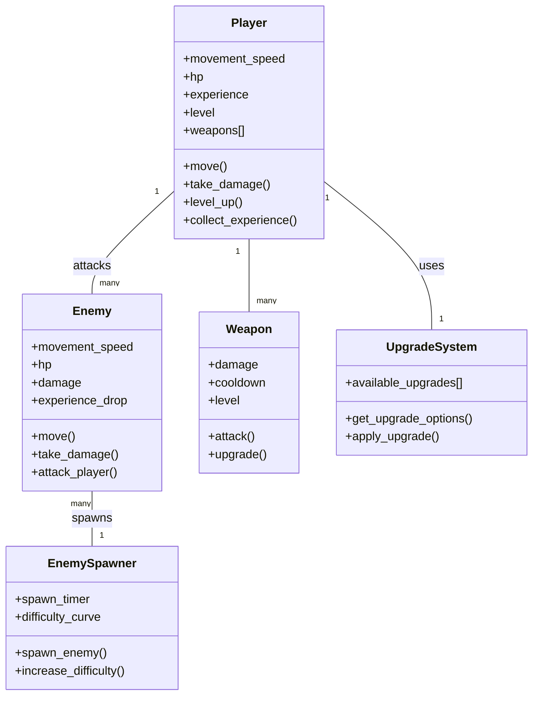

# RFG - Game Description and Architecture

## Game Overview

RFG appears to be a 2D action survival game built in Godot, similar to games like Vampire Survivors. The player controls a character who must survive waves of enemies by using various weapons and abilities. The game features:

- Multiple playable characters with different stats
- Various attack types (fireball, ice spear, javelin, shuriken, tornado)
- Different enemy types with unique behaviors
- Experience/leveling system with upgrades
- Multiple worlds/environments to play in
- Wave-based enemy spawning system

## Game Loop and Logic

### Text Description

1. **Game Initialization**:
   - Player selects a character from the character selection screen
   - Player selects a world to play in
   - The game initializes the player, world, and enemy spawner

2. **Core Game Loop**:
   - Player moves around the world using input controls
   - Enemy spawner continuously spawns enemies based on time and difficulty
   - Player attacks enemies using various weapons/abilities
   - Enemies move toward and attack the player
   - When enemies die, they may drop experience gems
   - Player collects experience to level up
   - On level up, player selects upgrades to enhance abilities
   - The difficulty increases over time with stronger/more enemies

3. **Game End Conditions**:
   - Player dies when health reaches zero
   - Game displays results and returns to menu

### Mermaid Diagram


## System Architecture



## Updated README.md

```markdown:README.md
# RFG

## What is this?

RFG is a 2D action survival game built using the Godot engine. It's a collaborative effort between siblings, combining our creativity and passion for game development. Inspired by games like Vampire Survivors, players must survive waves of enemies using various weapons and abilities.

## Game Features

- **Multiple Characters**: Choose from different characters with unique stats
- **Various Weapons**: Utilize fireballs, ice spears, javelins, shurikens, and tornados
- **Enemy Variety**: Face different enemy types with unique behaviors
- **Progression System**: Collect experience, level up, and upgrade your abilities
- **Multiple Worlds**: Play across different environments with unique challenges
- **Wave-based Combat**: Face increasingly difficult waves of enemies

## Game Loop

1. Select a character and world
2. Move around and attack enemies
3. Collect experience from defeated enemies
4. Level up and choose upgrades
5. Survive as long as possible against increasingly difficult waves

## Project Status

This project is currently in active development. Features and gameplay are continuously being refined and expanded.

## Getting Started

1. Clone the repository
2. Open the project in Godot Engine
3. Run the game from the editor or export to your platform of choice

## Controls

- WASD or Arrow Keys: Move character
- Weapons auto-attack when enemies are in range
- ESC: Pause game

## Development

This project is built with Godot 4.x and GDScript.
```
