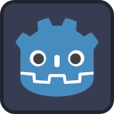

# RFG (Roguelike Fantasy Game)

  
  
<em>A 2D action survival roguelike built with Godot</em>

## Overview

RFG is a 2D action survival roguelike game built using the Godot engine. Inspired by games like Vampire Survivors, players must survive waves of increasingly difficult enemies using various weapons and abilities. The game features multiple playable characters, diverse enemy types, and different worlds to explore.

## Game Features

- **Multiple Characters**: Choose from different characters with unique stats and playstyles
- **Diverse Weapon System**: Utilize fireballs, ice spears, javelins, shurikens, and tornados
- **Enemy Variety**: Face different enemy types (bats, kobolds, cyclops, juggernauts) with unique behaviors
- **Progression System**: Collect experience gems, level up, and upgrade your abilities
- **Multiple Worlds**: Battle across different environments (Grasslands, Acacia, Infernius, Makka) with unique challenges
- **Wave-based Combat**: Face increasingly difficult waves of enemies as time progresses

## Game Loop

The core gameplay loop follows this pattern:

## System Architecture

The game is built with a modular architecture that separates different game systems:

## Project Structure

- **Player/**: Player character, controls, and attack systems
- **Enemies/**: Enemy types, behaviors, and spawning logic
- **World/**: Game environments and world-specific settings
- **Objects/**: Interactive game objects like chests and experience gems
- **Utility/**: Helper systems and shared functionality
- **Title Screen/**: Menu and character/world selection interfaces
- **Assets/**: Game art, audio, and other resources

## Controls

- **WASD** or **Arrow Keys**: Move character
- Weapons auto-attack when enemies are in range
- **ESC**: Pause game

## Getting Started

### For Players
1. Download the latest release for your platform
2. Run the game
3. Select your character and world
4. Survive as long as possible!

### For Developers
1. Clone the repository
2. Open the project in Godot Engine (4.x)
3. Run the game from the editor or export to your platform of choice

## Development Status

This project is currently in active development. Features and gameplay are continuously being refined and expanded.

## About the Project

RFG is a collaborative effort between siblings, combining our creativity and passion for game development. It serves as both a learning platform for mastering the Godot engine and a fun way to create and share games together as a family.

## License

[Include license information here]
